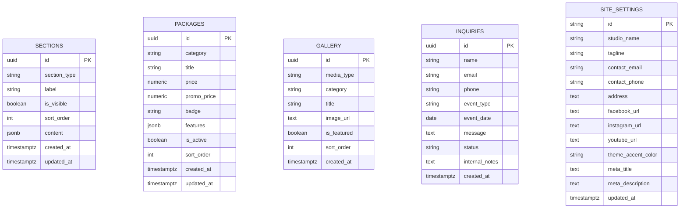

# RGP Films & Studio — Product Architecture & Technical Foundation

## 1. Executive Summary & Vision

**RGP Films & Studio** is evolving from a static portfolio website into a fully customizable, dynamic **Content Management System (CMS)** and **Booking Platform** built specifically for photography and videography studios.

The system combines:
1. **A High-Performance Public Portfolio (`/`)**: A fast, mobile-first showcase featuring an interactive carousel, video highlight reels, dynamic rates, and a spam-protected booking inquiry form.
2. **A Custom Admin CMS Dashboard (`/admin`)**: A visual control center allowing the studio owner to add/edit rates, upload and organize photography, embed highlight reels, manage client leads, and customize page layouts with a block-based builder.
3. **Zero-Cost Serverless Infrastructure**: 100% free hosting and database operation on **Cloudflare Pages / GitHub Pages** paired with **Supabase Free Tier**.

---

## 2. Technology Stack & Infrastructure

```mermaid
graph TD
    subgraph Hosting [100% Free Static Hosting]
        CF[Cloudflare Pages / GitHub Pages]
        CF --> App[Vue 3 + Vite SPA Bundle]
    end

    subgraph Client [Browser Runtime]
        App --> PublicView[Public Portfolio Views]
        App --> AdminView[Custom Admin CMS Views]
    end

    subgraph Backend [Supabase Serverless Cloud]
        Auth[Supabase Auth - Admin Login]
        Postgres[(PostgreSQL Database + RLS)]
        Storage[(Object Storage: Photos & Assets)]
    end

    PublicView <-->|Direct REST / GraphQL (Public Read)| Postgres
    PublicView <-->|CDN Image Delivery| Storage
    PublicView -->|Submit Booking Inquiries| Postgres

    AdminView <-->|JWT Authentication| Auth
    AdminView <-->|Full CRUD (Admin Role)| Postgres
    AdminView <-->|Upload & Delete Photos| Storage
```

### Stack Breakdown

| Layer | Technology | Purpose & Rationale |
| :--- | :--- | :--- |
| **Frontend Framework** | **Vue 3 (Composition API)** | Reactive Single Page Application with clean template syntax and lightweight bundle size |
| **Build Tool** | **Vite 7** | Instant HMR, fast builds, and optimized static asset packaging |
| **Styling & Theme** | **Tailwind CSS v4** + PostCSS | Utility-first styling with `@theme` custom fonts (*Bebas Neue*, *Italianno*, *Nuosu SIL*) |
| **Routing** | **Vue Router 4** | Client-side routing with navigation guards for `/admin` security |
| **Icons** | **Lucide Vue Next** | Clean, lightweight UI icons for admin tabs and public UI |
| **Database & API** | **Supabase (PostgreSQL)** | Managed relational database with auto-generated REST APIs and Row-Level Security |
| **Authentication** | **Supabase Auth** | Secure email & password admin sessions with JWT tokens |
| **Media Storage** | **Supabase Storage** | High-speed global CDN for full-resolution and WebP photography |
| **Video Delivery** | **YouTube / Vimeo Embeds** | Adaptive bitrate streaming for 1080p/4K wedding and event highlight reels |
| **Spam Protection** | **Cloudflare Turnstile** | Smart CAPTCHA verification + honeypot field + client rate limiting |

---

## 3. Core Modules & Specifications

### 3.1. Public Showcase & Portfolio (`/`)
* **Dynamic Block Rendering**: Renders sections dynamically based on the order and visibility configured in the CMS.
* **Infinite Showcase Carousel**: Responsive hero slider with active item centering, keyboard navigation, and tab filters.
* **Video Highlight Reel**: Clean, responsive video player for cinematic teasers and event films.
* **Interactive Rates & Packages Grid**: Filterable pricing tiers with expandable inclusion lists and direct "Book Package" triggers.
* **Lead Generation Form**: Multi-step inquiry form with event date selection, service categorization, and anti-spam validation.

---

### 3.2. Block-Based Page Builder
Allows adding, reordering, customizing, and toggling page sections on the fly:

```text
Preset Section Templates:
├── 1. Hero Banner (Headlines, CTA buttons, background photo or video loop)
├── 2. Infinite Carousel (Showcase slider for top featured photos)
├── 3. Photo Gallery Grid (2/3/4 column masonry grid with full-screen lightbox)
├── 4. Video Highlight Reel (YouTube/Vimeo player with event descriptions)
├── 5. Packages & Rates Table (Tiered pricing cards with inclusion checkmarks)
├── 6. About / Split Bio (Studio photo, photographer biography, experience counters)
├── 7. Rich Text / Story Block (Clean layout for policies, preparation guides, or philosophy)
├── 8. Client Testimonials (Review cards or quote carousel with client avatars)
├── 9. FAQ Accordion (Collapsible questions & answers)
├── 10. Call-to-Action (CTA) Banner (Full-width booking banner with direct buttons)
└── 11. Contact & Booking Form (Inquiry submission form with date pickers)
```

---

### 3.3. Admin CMS Dashboard (`/admin`)

#### A. 📊 Overview & Dashboard Hub
* Quick statistics: Unread inquiries count, active packages count, total gallery media.
* Recent inquiries feed with one-click actions (*Call*, *Email*, *Mark as Contacted*).
* Direct shortcuts to upload photos and create packages.

#### B. 📐 Page Layout Manager
* Drag-and-drop / Up-Down section reordering.
* Section visibility switches (Active / Draft / Hidden).
* Modular form editors per section type with live desktop/mobile preview simulators.

#### C. 🖼️ Media & Showcase Manager
* Multi-file drag-and-drop uploader.
* **In-Browser WebP Image Compressor**: Compresses high-res camera photos before upload to optimize storage and load speed.
* Album & category tagging (*Weddings*, *Debuts*, *Birthdays*, *Portraits*, *Graduation*, *Landscapes*, *Commercial*).
* Featured photo toggle for hero carousel.
* Video Highlight URL manager (YouTube/Vimeo links).

#### D. 💰 Services & Rates Manager
* Category tabs for easy package management.
* Package card editor (Title, Category, Regular Price, Promo Price, Badge, Active toggle).
* Dynamic inclusions list editor (add/edit bullet points).

#### E. 📬 Client Inquiries & Bookings Inbox
* Status pipeline: `New` ➔ `Contacted` ➔ `Booked` ➔ `Completed` ➔ `Archived`.
* Client detail view with name, email, phone/Viber, event date, and custom notes.
* CSV export for client records.

#### F. ⚙️ Site Settings & Branding
* Studio information (Name, Tagline, Phone, Email, Studio Address, Google Maps link).
* Social links (Facebook, Instagram, YouTube, TikTok).
* Theme accent color picker.
* SEO metadata & social share (OpenGraph) preview.

---

## 4. Database Schema & Security Specification



### 4.1. Row-Level Security (RLS) Rules

* **Public Visitor Permissions**:
  * `SELECT` on `sections` (where `is_visible = true`)
  * `SELECT` on `packages` (where `is_active = true`)
  * `SELECT` on `gallery`
  * `SELECT` on `site_settings`
  * `INSERT` on `inquiries` (Public submission with check)
* **Authenticated Admin Permissions**:
  * `ALL` (Select, Insert, Update, Delete) on `sections`, `packages`, `gallery`, `inquiries`, and `site_settings`.

---

## 5. Repository File Structure

```text
rgp/
├── ARCHITECTURE.md            # System architecture and technical reference
├── README.md                  # Project overview and setup commands
├── package.json               # Dependencies and build scripts
├── vite.config.js             # Vite configuration with Vue 3 plugin
├── supabase/
│   └── migrations/
│       └── 20260913_initial_schema.sql  # Turnkey PostgreSQL migration script
└── src/
    ├── main.js                # App entry point (mounts Vue + Router)
    ├── App.vue                # Root application layout
    ├── input.css              # Tailwind v4 theme, fonts, and custom styles
    ├── lib/
    │   └── supabase.js        # Supabase client singleton & auth state
    ├── router/
    │   └── index.js           # Vue Router definitions & auth guard
    ├── composables/           # Reusable state & data fetching hooks
    │   ├── useAuth.js
    │   ├── useSections.js
    │   ├── usePackages.js
    │   ├── useGallery.js
    │   ├── useInquiries.js
    │   └── useSettings.js
    ├── components/
    │   ├── public/            # Public-facing components & section templates
    │   │   ├── Navbar.vue
    │   │   ├── Footer.vue
    │   │   └── sections/
    │   │       ├── HeroSection.vue
    │   │       ├── CarouselSection.vue
    │   │       ├── GalleryGridSection.vue
    │   │       ├── VideoSection.vue
    │   │       ├── RatesSection.vue
    │   │       ├── AboutSection.vue
    │   │       ├── TextBlockSection.vue
    │   │       ├── TestimonialsSection.vue
    │   │       ├── FaqSection.vue
    │   │       ├── CtaSection.vue
    │   │       └── ContactSection.vue
    │   └── admin/             # Admin CMS UI components
    │       ├── AdminHeader.vue
    │       ├── AdminNav.vue
    │       ├── PhotoUploader.vue
    │       ├── PackageModal.vue
    │       └── SectionEditorModal.vue
    ├── views/
    │   ├── HomeView.vue       # Public Landing Page
    │   └── admin/
    │       ├── LoginView.vue     # Secure Admin Login
    │       └── DashboardView.vue # Full CMS Dashboard with Tab Navigation
    └── public/                # Static public assets (fonts, images, robots.txt)
```

---

## 6. Development & Deployment Roadmap

1. **Phase 1: Project Scaffolding & Dependencies**
   * Install Vue 3, Vue Router, Supabase JS, and Lucide icons.
   * Configure `vite.config.js` and update Tailwind setup.
2. **Phase 2: Database & Storage Provisioning**
   * Apply PostgreSQL migration script and RLS policies to Supabase.
   * Create public `portfolio` storage bucket.
3. **Phase 3: Public SPA Conversion**
   * Convert static HTML elements into modular Vue single-file components.
   * Connect public components to fetch data dynamically from Supabase.
4. **Phase 4: Admin CMS Dashboard Implementation**
   * Build authentication flow and route guards.
   * Build the Overview, Page Builder, Media Uploader, Rates Manager, and Inquiries Inbox.
5. **Phase 5: Optimization & Production Deployment**
   * Test client-side WebP compression.
   * Configure production build on Cloudflare Pages / GitHub Pages.
